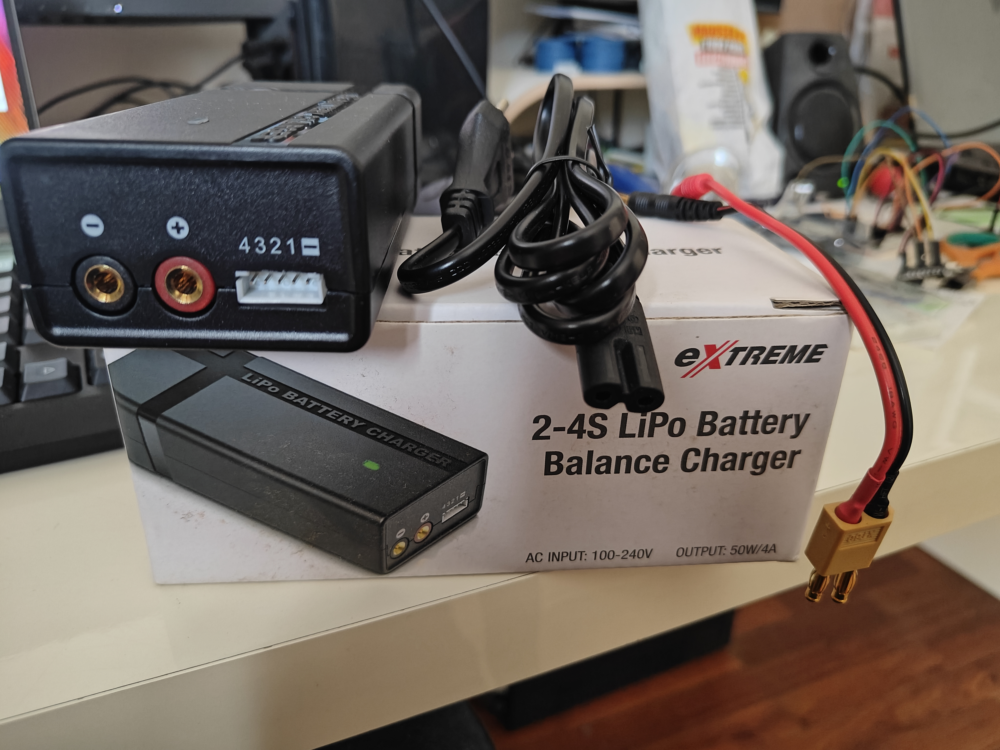
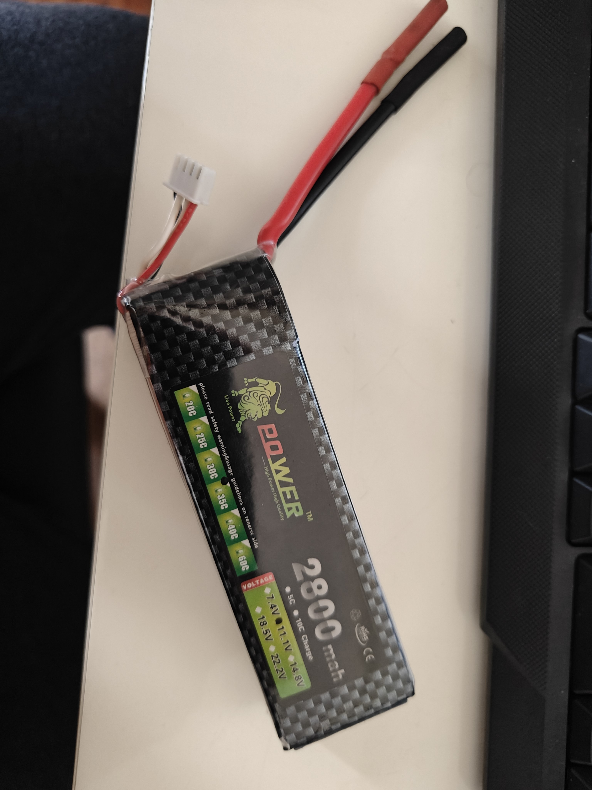

# Li-Po Battery Charging

This page describes my experience charging a Li-Po battery for the first time.
The components are the following:
- Li-Po Battery Smart Charger (1-4S )
- Li-Po Battery 3 cell 11.1V 2800mAh 30C()
---

The Charger and components 
 
The Battery 
 

---

## 📝 Important Things/Informations

- each cell has 3.7V +-. so the Voltage is just NumberOFCells * 3.7 
- mAh is the amount of time it can handle a load (example, if your system requests 1.4A, this fully loaded battery would hold for 2h,  `2800 mAh / 1.4 A = 2 hours` )
- C is the amount of possible drain. 1C = 2.8A, so 30C, means you can request a maximum of  `2.8A * 30 = 84A` from this battery.
- ALWAYS use a smart charger for Li-Po Batteries.
- multi-cell batteries need to be balanced. that is what that small plug is for. ALWAYS connect it first to the charger.

Connecting them, is fairly simple. Just the balance plug 1st, then the battery red and black, and wait for about 1-2h for charging.
Read the instructions on the charger. Mine said, blinking green was ready, blinking red was charging, then changing red to green (is was a yellowish green) and then it was a constant green when fully charged. Pretty cool. And after 10 years of waiting!!!!

After this, I used it to try and power the brushless motor [here](https://github.com/jpinela/variousscripts/tree/main/arduino/esc).

There were several links and videos that helped me understand this.
Some were:
- https://youtu.be/UahHDoQ8xLQ?si=rYPvFzUo3OQddu74
- https://www.youtube.com/watch?v=1gb8Oohhciw
- https://youtu.be/Lk7wzVYmXSA?si=ix-CYWEc5YYkOlAQ
- https://youtu.be/Lk7wzVYmXSA?si=PRcsI1WmYP2Y2R7j
- https://youtu.be/1gb8Oohhciw?si=CF19cQvh_ul2UfBz
